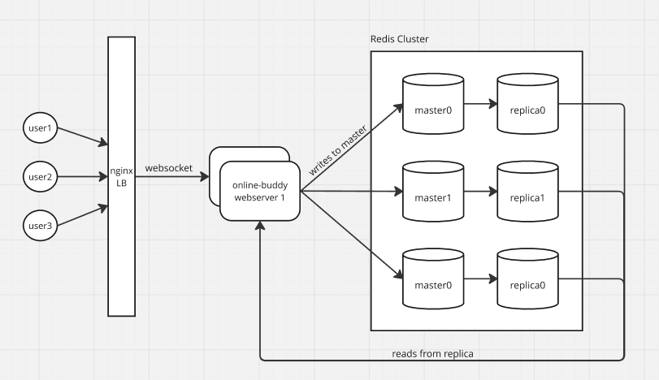

# online-buddy

The goal is to create a system which show online presence of friends in a highly scalable system. The current implementation looks like this:

You can test it by running `docker-compose up` and opening `http://localhost:8080`. Open new tabs as different friends and connect (links are provided in index.html for easy access)

You can see the hardcoded friend relationships using `http://localhost:8080/friends`.

Since pubsub doesn't scale horizontally by default in redis, this system is flawed because the users connecting to different redis master nodes can't "see" each other because the channels are not shared.

There are a few ways to overcome this which need to be explored:

* create a redis node specifically for pubsub - this will fail when we have a lot of users and is a single point of failure. Even though we scale the storage, we can't scale the channels
* implement some hash based sharding and some complex logic on top to handle which redis node to connect to using the friends list - this has some pitfalls when new friends are added and might be too complex to manage
* use a different system which scales pubsub horizontally. some options to explore are: nats/kafka/rabbitmq